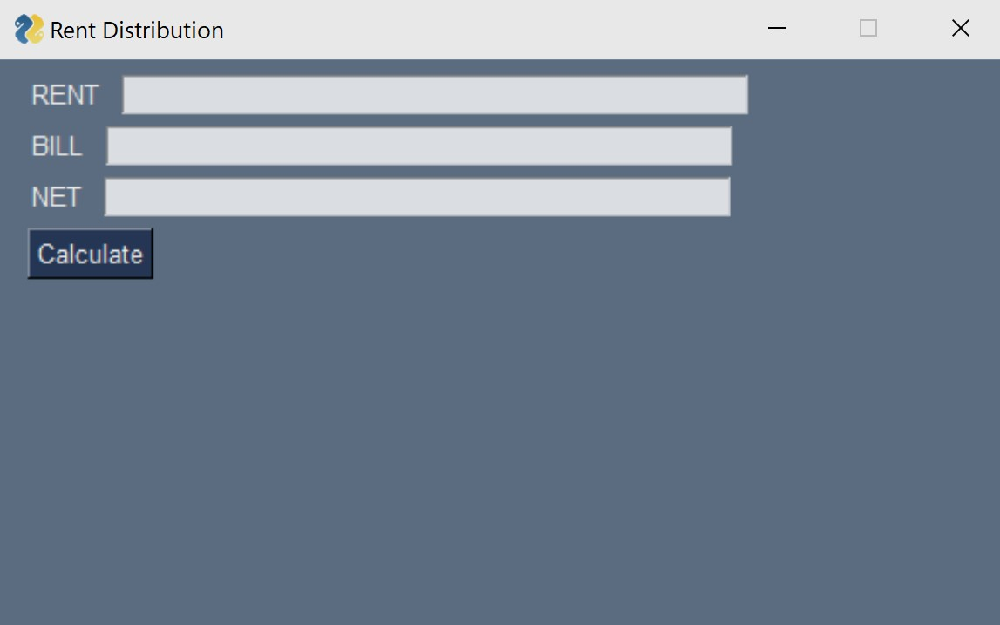
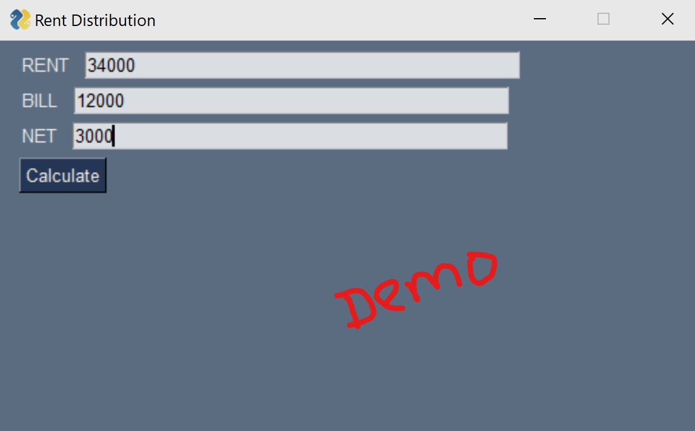
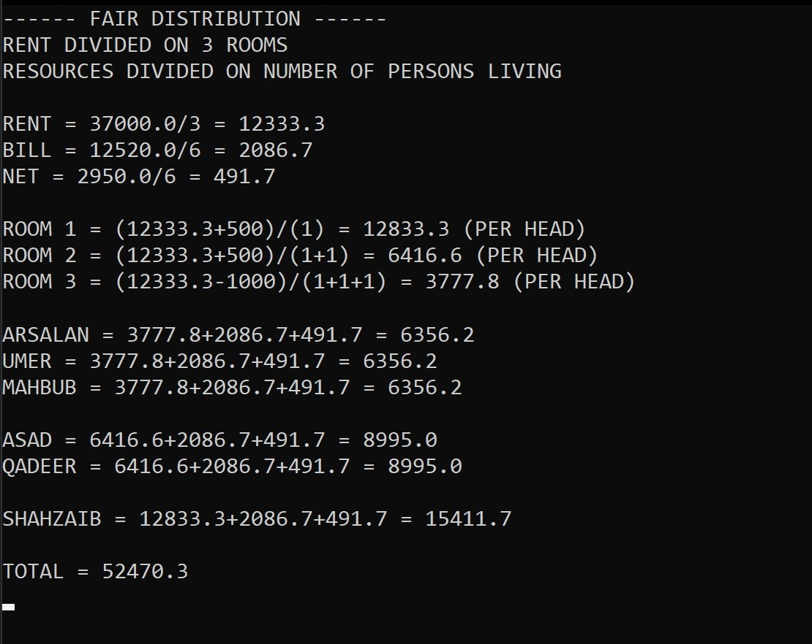

# Rent Calculator GUI


## Standalone Application
- Simply Double-Click on `rent_calculator.exe` in Windows

#

## Install

```
pip install -r requirements.txt
```

## Run

```
python app.py
```


## Layout




#

### Developed by @Ghost